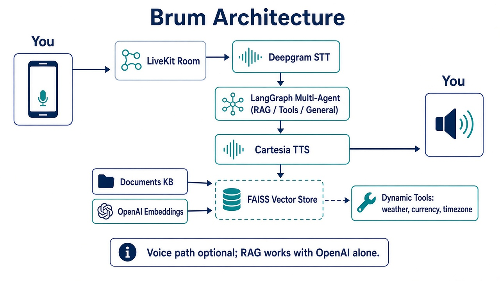

# Brum — Voice Knowledge Assistant

Personal **voice + RAG** assistant over a knowledge base. Talk (or text-query) Brum; it retrieves from your documents, optionally calls tools, and answers.

Repo: [`pritamexe2k4-cmyk/brum-voice-assistant`](https://github.com/pritamexe2k4-cmyk/brum-voice-assistant)

---

## Architecture



**Flow (voice):** You → LiveKit room → Deepgram STT → LangGraph multi-agent (RAG / Tools / General) → Cartesia TTS → You  

**Knowledge path:** `documents/` → chunking → OpenAI embeddings → **FAISS** (`vector_store/`) → RAG agent  

**Note:** Voice stack is optional. With **only `OPENAI_API_KEY`** you can ingest docs and test retrieval via `python src/rag_system.py`.

---

## What’s in this project

| Area | Role |
| --- | --- |
| `src/rag_system.py` | Ingest docs, build/load FAISS, retrieval tool |
| `src/multi_agent_rag.py` | LangGraph orchestrator (RAG / tools / general) |
| `src/dynamic_tools.py` | Weather, currency, timezone helpers |
| `src/agent.py` | LiveKit voice agent entry (STT/LLM/TTS) |
| `src/metrics_logger.py` | Latency / run metrics |
| `documents/` | Sample KB (AI, climate, history, blockchain, health) |
| `vector_store/` | Local FAISS index (committed for quick start; regenerate anytime) |
| `research/` | Brum product decisions log |
| `PHASE1_PRP.md` | Phase-1 product requirements |
| `DEPLOYMENT_GUIDE.md` | Render / LiveKit deploy notes |

---

## Stack

| Layer | Tech |
| --- | --- |
| Language | Python 3.11+ (3.13 recommended by upstream) |
| Orchestration | LangChain + **LangGraph** |
| LLM / embeddings | **OpenAI** |
| Vector DB | **FAISS** (local) |
| Realtime voice | **LiveKit Agents** |
| STT | **Deepgram** |
| TTS | **Cartesia** |
| Optional tools | WeatherAPI (+ currency/timezone utilities) |
| Deploy | Docker + Render blueprint (`render.yaml`) |

---

## Quick start (local)

### 1) Clone & venv

```powershell
git clone https://github.com/pritamexe2k4-cmyk/brum-voice-assistant.git
cd brum-voice-assistant
python -m venv .venv
.\.venv\Scripts\Activate.ps1
pip install -r requirements.txt
```

### 2) Env

```powershell
copy .env.example .env.local
```

Edit `.env.local`:

```env
OPENAI_API_KEY=sk-...          # required for RAG
WEATHER_API_KEY=...            # optional tools
LIVEKIT_URL=...                # required for voice
LIVEKIT_API_KEY=...
LIVEKIT_API_SECRET=...
DEEPGRAM_API_KEY=...           # voice in
CARTESIA_API_KEY=...           # voice out
```

Never commit `.env.local`.

### 3) Build / test RAG (OpenAI only)

```powershell
python src\rag_system.py
```

This loads `documents/`, embeds, writes/reads `vector_store/`, and runs sample retrieval queries.

### 4) Voice agent (needs LiveKit + Deepgram + Cartesia)

```powershell
python src\agent.py dev
```

Then join a LiveKit room (LiveKit Cloud / Meet) so Brum can hear and speak.

---

## Overall system design

1. **Ingest:** text files in `documents/` → recursive chunking → embeddings → FAISS  
2. **Retrieve:** top-k chunks for a query  
3. **Route:** LangGraph picks RAG vs tool vs general chat  
4. **Speak (optional):** LiveKit session wires STT → graph → TTS with VAD / turn detection  

Brum’s product direction (personal KB, calm UI, later friends/teams) is tracked in `research/research.md` and `PHASE1_PRP.md`. This runtime is the **engine** you run under the Brum name.

---

## Deployment

### Docker

```bash
docker build -t brum-voice .
docker run --env-file .env.local brum-voice
```

### Render

See **[DEPLOYMENT_GUIDE.md](./DEPLOYMENT_GUIDE.md)** (use this repo `pritamexe2k4-cmyk/brum-voice-assistant`, env group for LiveKit/OpenAI/Deepgram/Cartesia/Weather).

Blueprint file: `render.yaml`.

---

## Suggested test checklist

- [ ] `python src/rag_system.py` prints `[SUCCESS] RAG System Ready!`  
- [ ] Retrieval answers match docs (AI / climate / history / blockchain / health)  
- [ ] (Optional) LiveKit room + `agent.py` responds by voice  
- [ ] `.env.local` never appears in `git status`

---

## License / provenance

Runtime adapted from a RAGVoice-AI reference implementation; product branding and roadmap are **Brum**. See `LICENSE`.
